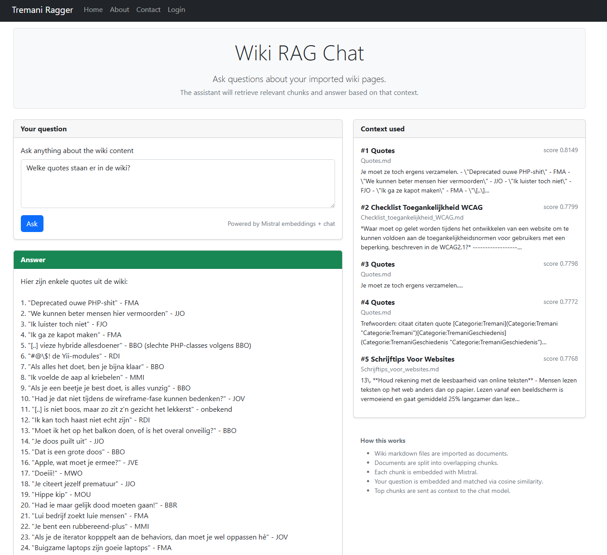

# Yii2 Mistral RAG Wiki Demo

A lightweight, local Retrieval-Augmented Generation (RAG) system built with **Yii2**, **SQLite**, and **Mistral.ai**.  
It ingests Markdown wiki files, chunks them, embeds them, and lets you ask questions via CLI or a clean web UI.



---

## Features

- **Local-first RAG pipeline**
  - Markdown wiki files imported into a local SQLite database (`runtime/rag.sqlite`)
  - Pluggable chunking strategies:
    - **WordChunkStrategy** — simple fixed-size windows
    - **SemanticChunkStrategy** — overlap-aware, heading/paragraph semantic blocks
  - Embeddings generated using **Mistral.ai**
  - **Cosine similarity** ranking to retrieve the most relevant chunks
  - Top-K chunks injected as context into a Mistral chat model (`mistral-small`)

- **Two interfaces**
  - CLI workflow: import → chunk → embed → ask
  - Web-based chat interface at **/chat**

- **Safe configuration**
  - API key is *never* committed to Git
  - Environment-variable based configuration

---

## Requirements

- PHP **8.2+**
- Composer
- SQLite + PDO SQLite extension
- Git
- A **Mistral.ai API key** (`MISTRAL_API_KEY`)
- Supported OS:
  - Windows (recommended: **Git Bash**)
  - macOS
  - Linux

---

## Installation

### 1. Clone the repository

```bash
git clone https://github.com/your-org/your-rag-yii2-project.git
cd your-rag-yii2-project
```

### 2. Install dependencies

```bash
composer install
```

### 3. Configure the Mistral API key

#### Linux / macOS

```bash
export MISTRAL_API_KEY="your-mistral-api-key"
echo 'export MISTRAL_API_KEY="your-mistral-api-key"' >> ~/.bashrc
# or for zsh
echo 'export MISTRAL_API_KEY="your-mistral-api-key"' >> ~/.zshrc
source ~/.bashrc
```

#### Windows (Git Bash)

```bash
export MISTRAL_API_KEY="your-mistral-api-key"
echo 'export MISTRAL_API_KEY="your-mistral-api-key"' >> ~/.bashrc
source ~/.bashrc
```

Never commit your API key. It must remain in environment variables or a local config file.

---

## How `params.php` resolves the API key

`config/params.php`:

```php
<?php
return [
    'mistral' => [
        'api_key' =>
            $local['mistral']['api_key']
            ?? getenv('MISTRAL_API_KEY')
            ?: '',

        'base_url' => 'https://api.mistral.ai',
        'timeout' => 30,
        'embedding_model' => 'mistral-embed',
        'chat_model' => 'mistral-small',
        'max_tokens' => 500,
        'temperature' => 0.2,
        'rate_limit_seconds' => 1.0,
    ],
];
```

Resolution order:

1. `config/params-local.php` (not committed to Git)
2. Environment variable `MISTRAL_API_KEY`
3. Otherwise: empty string → Mistral requests fail

Recommended `config/params-local.php`:

```php
<?php
return [
    'mistral' => [
        'api_key' => getenv('MISTRAL_API_KEY') ?: 'your-mistral-api-key',
    ],
];
```

---

## Database

- SQLite file: `runtime/rag.sqlite`
- `config/db.php`:

```php
<?php
return [
    'class' => yii\db\Connection::class,
    'dsn' => 'sqlite:@app/runtime/rag.sqlite',
    'charset' => 'utf8',
];
```

Yii creates the file when migrations run.

---

## Quick Start

Pipeline overview:

1. Set `MISTRAL_API_KEY`
2. Install dependencies
3. Run migrations
4. Put wiki `.md` files into `runtime/wiki`
5. Import
6. Chunk
7. Embed
8. Start server
9. Ask questions (CLI or UI)

### Quick Start (Linux/macOS)

```bash
git clone https://github.com/your-org/your-rag-yii2-project.git
cd your-rag-yii2-project

export MISTRAL_API_KEY="your-key"

composer install
php yii migrate --interactive=0

php yii rag/import-wiki @app/runtime/wiki
php yii rag/build-chunks semantic
php yii rag/build-embeddings

php yii serve --docroot=@app/web --port=8080
```

Open: `http://localhost:8080/chat`

### Quick Start (Windows Git Bash)

```bash
git clone https://github.com/your-org/your-rag-yii2-project.git
cd your-rag-yii2-project

export MISTRAL_API_KEY="your-key"

composer install
php yii migrate --interactive=0

php yii rag/import-wiki @app/runtime/wiki
php yii rag/build-chunks semantic
php yii rag/build-embeddings

php yii serve --docroot=@app/web --port=8080
```

Alternative:

```bash
php -S localhost:8080 -t web
```

---

## CLI Workflow

Import wiki files:

```bash
php yii rag/import-wiki @app/runtime/wiki
```

Chunk documents:

```bash
php yii rag/build-chunks word
php yii rag/build-chunks semantic
```

Build embeddings:

```bash
php yii rag/build-embeddings
php yii rag/build-embeddings 1000   # limit
```

Ask questions:

```bash
php yii rag/ask "Hoe vraag ik verlof aan bij Tremani?"
php yii rag/ask "Hoe vraag ik verlof aan bij Tremani?" 10
```

---

## Web UI Workflow

Start server:

```bash
php yii serve --docroot=@app/web --port=8080
```

Open: `http://localhost:8080/chat`

The UI provides the question box, answer, and chunk context (rank, score, title, preview) using the same logic as the CLI via `RagService`.

---

## Architecture Overview

```text
Markdown (.md)
   ↓
rag/import-wiki
   ↓
Documents (SQLite)
   ↓
rag/build-chunks
   ↓
Chunks (embedding_json="[]")
   ↓
rag/build-embeddings
   ↓
Chunks with embeddings
   ↓
User question (CLI or UI)
   ↓
Embed question
   ↓
Cosine similarity search
   ↓
Top-K chunks
   ↓
Mistral chat model
   ↓
Answer
```

---

## Components

- Models: `Document`, `Chunk`
- Components: `MistralClient`, `RagService`
- Console: `RagController`
- Web: `ChatController`
- DI container: registers `MistralClient` + `RagService` as singletons

---

## Development

Switch chunking strategy:

```bash
php yii rag/build-chunks word
php yii rag/build-chunks semantic
```

Typical cycle:

```bash
php yii rag/build-chunks semantic
php yii rag/build-embeddings
php yii rag/ask "Your question"
```

Reset everything:

```bash
php yii migrate/down 2 --interactive=0
php yii migrate --interactive=0

php yii rag/import-wiki @app/runtime/wiki
php yii rag/build-chunks semantic
php yii rag/build-embeddings
```

---

## Troubleshooting

**Missing API key**  
Symptoms: `401 Unauthorized`, “Bearer token not found”  
Fix: Set `MISTRAL_API_KEY` or configure `params-local.php`.

**No chunks with embeddings**  
Run:

```bash
php yii rag/import-wiki @app/runtime/wiki
php yii rag/build-chunks semantic
php yii rag/build-embeddings
```

**SQLite missing**  
Fix:

```bash
php yii migrate --interactive=0
```

Ensure `runtime/` is writable.

---

## License

Based on the Yii2 Basic Project Template.  
Licensed under BSD-3-Clause.
